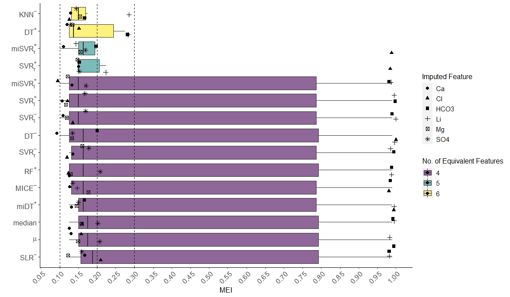
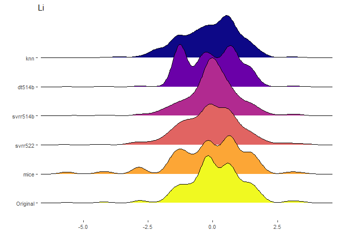
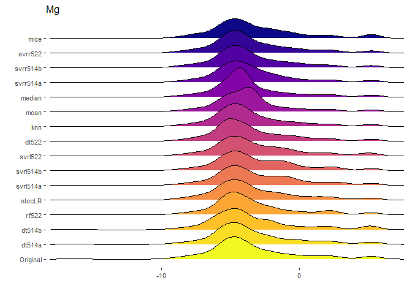
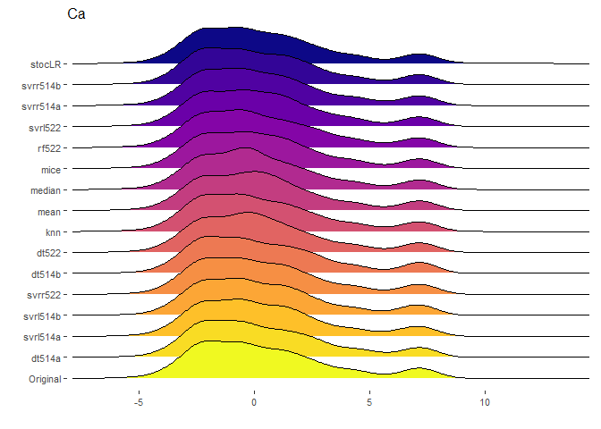
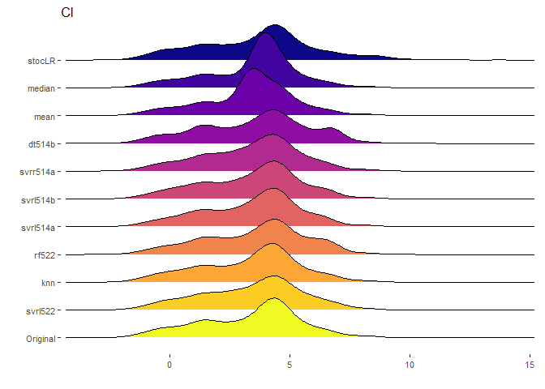
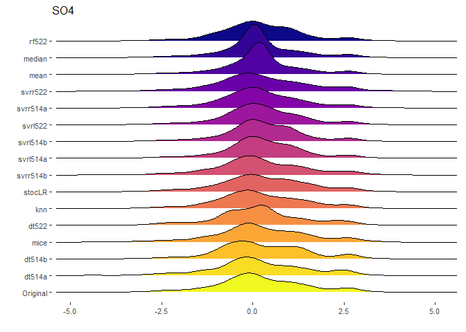
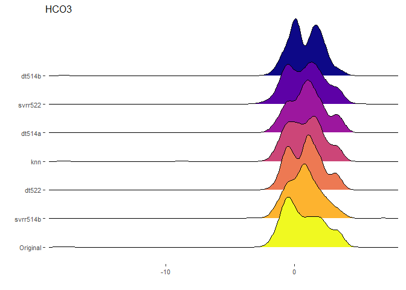
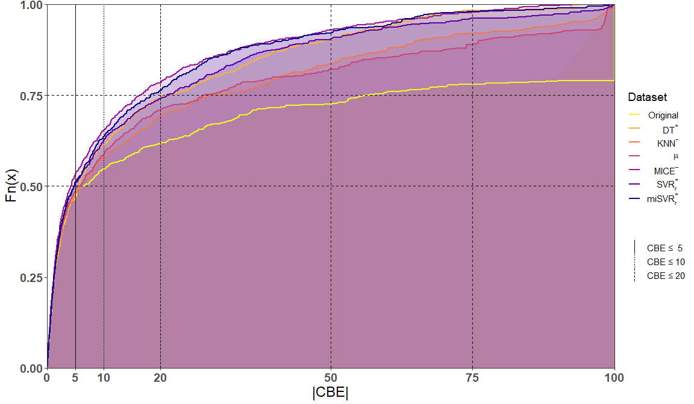

# Libraries


```r
library(TOSTER)
library(stringr)
library(dplyr)
```

```
## 
## Attaching package: 'dplyr'
```

```
## The following objects are masked from 'package:stats':
## 
##     filter, lag
```

```
## The following objects are masked from 'package:base':
## 
##     intersect, setdiff, setequal, union
```

```r
library(reshape)
```

```
## 
## Attaching package: 'reshape'
```

```
## The following object is masked from 'package:dplyr':
## 
##     rename
```

```r
library(ggplot2)
library(ggridges)
library(viridis)
```

```
## Loading required package: viridisLite
```

```r
library(scales)
```

```
## 
## Attaching package: 'scales'
```

```
## The following object is masked from 'package:viridis':
## 
##     viridis_pal
```

```r
library(latex2exp)
```

# Function to transform from PPM to Milliequivalents


```r
raw.2.mlEquivalent <- function(tmp_df)
{
  res_df <- tmp_df
  
  res_df$Na   <- tmp_df$Na/22.989770
  res_df$K    <- tmp_df$K/39.0983
  res_df$Mg   <- (tmp_df$Mg*2)/24.3050
  res_df$Ca   <- (tmp_df$Ca*2)/40.078
  res_df$Li   <- tmp_df$Li/6.941
  res_df$Cl   <- tmp_df$Cl/35.4527
  res_df$SO4  <- (tmp_df$SO4*2)/(32.066+(15.9994*4))
  res_df$HCO3 <- (tmp_df$HCO3)/(1.00794+12.0107+(15.9994*3))
  
  return(res_df)
}
```

# Transform from PPM to MilliEquivalents

The original and imputed WCGDb must be in the working directory.
But first, we require to locate the original and the imputed datasets.
For illustration purposes, the working directory is set to

"C:/Users/guillermo.santamaria/Documents/Results"

Modify this path to your convenience.


```r
knitr::opts_knit$set(root.dir = 'C:/Users/guillermo.santamaria/Documents/Results')
```

## Original Data


```r
orig_csv_name = 'original/simplifiedWCGDb.csv'
original.data <- read.csv(orig_csv_name, header = T, stringsAsFactors = F)

drop_col <- c('X')#Id column

tmp_ixes <- !(colnames(original.data) %in% drop_col)
ft_names <- colnames(original.data)[tmp_ixes]

original.data <- original.data[,ft_names]
original.data <- raw.2.mlEquivalent(original.data)
```

## Imputed Data


```r
imp_path<- paste0(getwd(),'/GFD Imputed DB/')

files_ls <- list.files(imp_path)
imp_dfs <- list()

for(i in 1:length(files_ls))
{
  # print(files_ls[i])
  imp_dfs[[i]] <- read.csv(paste0(imp_path,files_ls[i]), header = T)
  imp_dfs[[i]]['Temperature'] <- original.data$Temperature
  imp_dfs[[i]] <- imp_dfs[[i]][,ft_names]
  imp_dfs[[i]] <- raw.2.mlEquivalent(imp_dfs[[i]])
}
```

### Renaming imputed datasets by the name of the algorithm


```r
imp_file_names <- strsplit(files_ls, '_')
imp_names <- sapply(1:length(imp_file_names), 
                    function(i) imp_file_names[[i]][2])
names(imp_dfs) <- imp_names
```


```r
na_col_ixes <- sapply(1:dim(original.data)[2], 
                      function(i) any(is.na(original.data[,i])))

ckc4eqv.ft <- colnames(original.data)[na_col_ixes]

EqvlntImp.df <- data.frame(expand.grid(imp_names,ckc4eqv.ft))
colnames(EqvlntImp.df) <- c('algorithm', 'imputed.var')

EqvlntImp.df <- EqvlntImp.df %>% 
                mutate(algorithm.parsed = recode_factor(algorithm, 
                                                        'dt514a' = "DT^-", 
                                                        'dt514b' = "DT^*", 
                                                        'dt522' = "miDT^*", 
                                                        'knn' = "KNN^-",
                                                        'mean' = "mu",
                                                        'median' = "median",
                                                        'mice' = "MICE^-",
                                                        'rf522' = "RF^*",
                                                        'stocLR' = "StochLR",
                                                        'svrl514a' = "SVR_l^-", 
                                                        'svrl514b' = "SVR_l^*", 
                                                        'svrl522' = "miSVR_l^*",
                                                        'svrr514a' = "SVR_r^-", 
                                                        'svrr514b' = "SVR_r^*", 
                                                        'svrr522' = "miSVR_r^*"
                                                        ))

EqvlntImp.df$algorithm <- as.character(EqvlntImp.df$algorithm)
EqvlntImp.df$imputed.var <- as.character(EqvlntImp.df$imputed.var)

EqvlntImp.df$min.Eq.val <- 0.99
EqvlntImp.df$p.ttest    <- 0.001
EqvlntImp.df$p.tost     <- 0.99
EqvlntImp.df$has.eqvlnc <- F
```


```r
for(j in 1:dim(EqvlntImp.df)[1])
{
  tmp_df  <- imp_dfs[[EqvlntImp.df$algorithm[j]]]
  tmp_ft  <- EqvlntImp.df$imputed.var[j]
  ft_orig <- original.data[,tmp_ft]
  ft_imp  <- tmp_df[,tmp_ft]
  
  d <- seq(0.0001, 0.99, by = 0.025)
  df_tost <- data.frame()
  for (i in 1:length(d)) 
  {
    
    m1 <- mean(ft_orig,na.rm = T)
    m2 <- mean(ft_imp)
    
    sd1 <- sd(ft_orig,na.rm = T)
    sd2 <- ifelse(sd(ft_imp)==0,0.000000001,sd(ft_imp))
    
    n1 <- length(na.omit(ft_orig))
    n2 <- length(ft_imp)
    
    low_eqbound_d  <- -d[i]
    high_eqbound_d <- d[i]
    
    alpha <- 0.05
    
    tost.test <- TOSTtwo(m1, m2, 
                         sd1, sd2, 
                         n1, n2, 
                         low_eqbound_d, high_eqbound_d, 
                         alpha,
                         var.equal = F, plot = F, verbose = F)
    
    sdpooled <- sqrt((sd1^2 + sd2^2)/2)
    low_eqbound <- low_eqbound_d * sdpooled
    high_eqbound <- high_eqbound_d * sdpooled
    degree_f <- (sd1^2/n1 + sd2^2/n2)^2/(((sd1^2/n1)^2/(n1 - 
                                                          1)) + ((sd2^2/n2)^2/(n2 - 1)))
    t1 <- ((m1 - m2) - low_eqbound)/sqrt(sd1^2/n1 + sd2^2/n2)
    p1 <- pt(t1, degree_f, lower.tail = FALSE)
    t2 <- ((m1 - m2) - high_eqbound)/sqrt(sd1^2/n1 + sd2^2/n2)
    p2 <- pt(t2, degree_f, lower.tail = TRUE)
    t <- (m1 - m2)/sqrt(sd1^2/n1 + sd2^2/n2)
    pttest <- 2 * pt(-abs(t), df = degree_f)
    ptost <- max(p1, p2)
    
    df_tost <- rbind(df_tost, data.frame(tost.test))
    if(pttest > alpha && ptost <= alpha) 
    {
      EqvlntImp.df$min.Eq.val[j] <- d[i]
      EqvlntImp.df$p.ttest[j]    <- pttest
      EqvlntImp.df$p.tost[j]     <- ptost
      
      na_ix   <- is.na(ft_orig)
      
      #------------
      #Uncomment the following code if you want to observe the density function
      #of the original WCGDb vs the imputed dataset
      
      # plot(density(ft_orig[!na_ix]), col = "blue",
      #      main=EqvlntImp.df$algorithm[j], xlab =tmp_ft,
      #      cex.lab=1.4, cex.axis=1.4, cex.main=1.4, cex.sub=1.4 )
      # lines(density(ft_imp), col = "red")
      
      #------------
      
      EqvlntImp.df$has.eqvlnc[j] <- T

      break
    }
  }
}
```

## Minimun Equivalence Interval


```
## # A tibble: 66 x 7
## # Groups:   imputed.var [6]
##    algorithm imputed.var algorithm.parsed min.Eq.val p.ttest p.tost has.eqvlnc
##    <chr>     <chr>       <fct>                 <dbl>   <dbl>  <dbl> <lgl>     
##  1 dt514b    Li          DT^*                  0.275  0.0741 0.0468 TRUE      
##  2 knn       Li          KNN^-                 0.275  0.0807 0.0400 TRUE      
##  3 mice      Li          MICE^-                0.150  0.839  0.0327 TRUE      
##  4 svrr514b  Li          SVR_r^*               0.225  0.270  0.0292 TRUE      
##  5 svrr522   Li          miSVR_r^*             0.150  0.644  0.0494 TRUE      
##  6 dt514a    Mg          DT^-                  0.125  0.597  0.0436 TRUE      
##  7 dt514b    Mg          DT^*                  0.125  0.561  0.0477 TRUE      
##  8 dt522     Mg          miDT^*                0.150  0.517  0.0208 TRUE      
##  9 knn       Mg          KNN^-                 0.150  0.529  0.0199 TRUE      
## 10 mean      Mg          mu                    0.150  0.503  0.0219 TRUE      
## # ... with 56 more rows
```

<!-- -->

### Ridgeline plots of original vs Imputed dataset
In order to appreciate the imputation quality carried out by the different 
imputation algorithms, the density distribution function of the original WCGDb 
against the datasets obtained by the imputation algorithms is shown.


```
## Using  as id variables
```

```
## Picking joint bandwidth of 0.259
```

```
## Warning: Removed 452 rows containing non-finite values (stat_density_ridges).
```

```
## Using  as id variables
```

<!-- -->

```
## Picking joint bandwidth of 0.59
```

```
## Warning: Removed 114 rows containing non-finite values (stat_density_ridges).
```

```
## Using  as id variables
```

<!-- -->

```
## Picking joint bandwidth of 0.684
```

```
## Warning: Removed 44 rows containing non-finite values (stat_density_ridges).
```

```
## Using  as id variables
```

<!-- -->

```
## Picking joint bandwidth of 0.484
```

```
## Warning: Removed 157 rows containing non-finite values (stat_density_ridges).
```

```
## Using  as id variables
```

<!-- -->

```
## Picking joint bandwidth of 0.255
```

```
## Warning: Removed 191 rows containing non-finite values (stat_density_ridges).
```

```
## Using  as id variables
```

<!-- -->

```
## Picking joint bandwidth of 0.375
```

```
## Warning: Removed 412 rows containing non-finite values (stat_density_ridges).
```

<!-- -->

# Charge Balance Error Analysis


```
## Using  as id variables
## Using  as id variables
```

<!-- -->

